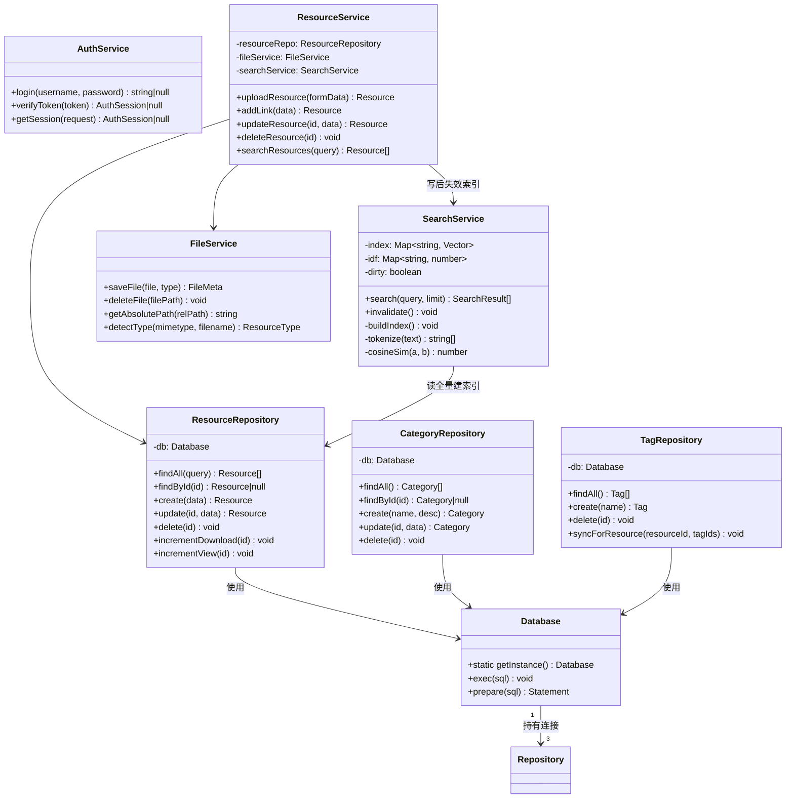
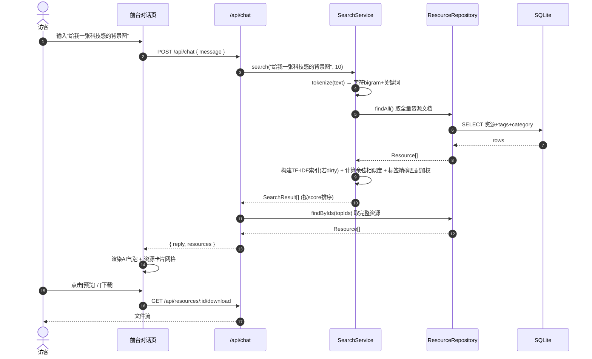
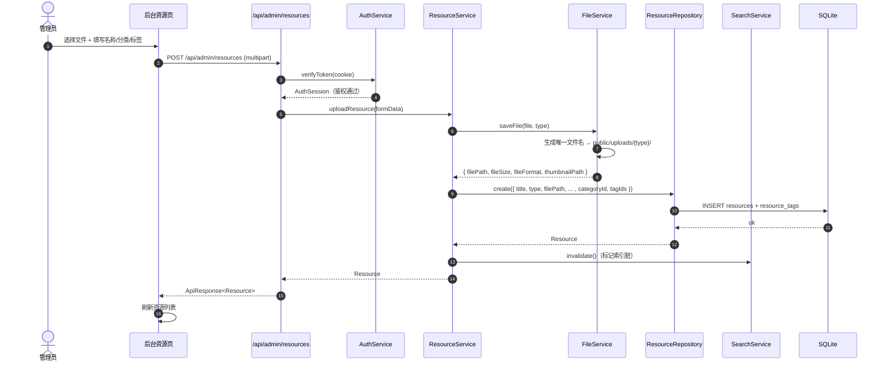
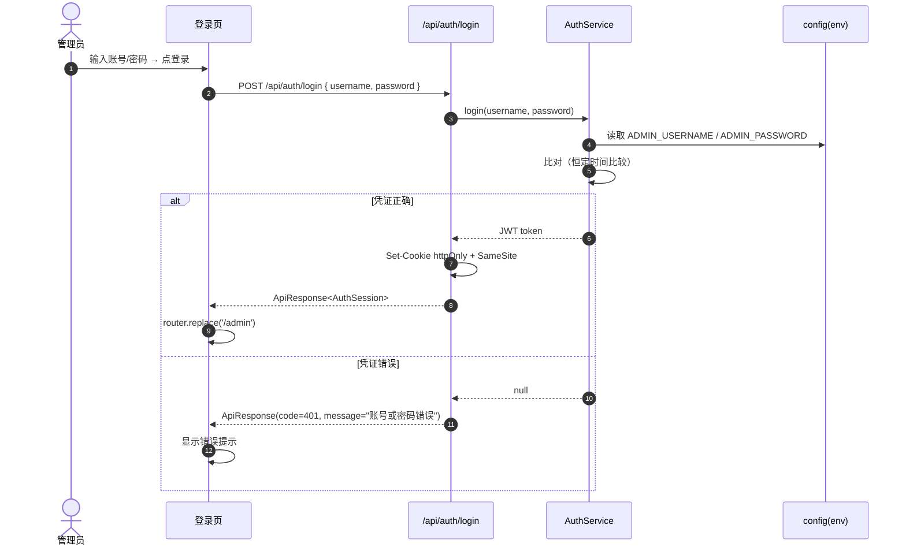
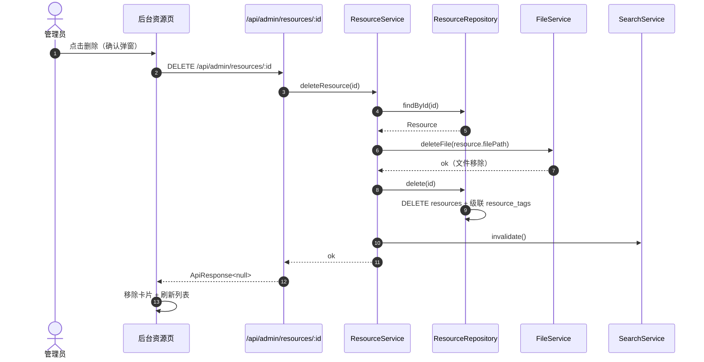
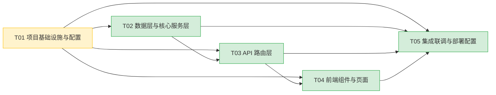

# 系统架构设计文档（ARCHITECTURE）

## 小雷没摸鱼 Agent — 全栈对话式资源管理平台

> 架构师：高见远（Gao） | 版本：v1.0 | 基于 PRD v1.0

---

## 目录

- [Part A：系统设计](#part-a系统设计)
  - [1. 实现方案与框架选型](#1-实现方案与框架选型)
  - [2. 文件列表及相对路径](#2-文件列表及相对路径)
  - [3. 数据结构与接口](#3-数据结构与接口)
  - [4. 程序调用流程](#4-程序调用流程)
  - [5. 待明确事项](#5-待明确事项)
- [Part B：任务分解](#part-b任务分解)
  - [6. 依赖包列表](#6-依赖包列表)
  - [7. 任务列表](#7-任务列表)
  - [8. 共享知识（跨文件约定）](#8-共享知识跨文件约定)
  - [9. 任务依赖图](#9-任务依赖图)

---

# Part A：系统设计

## 1. 实现方案与框架选型

### 1.1 核心技术挑战分析

| 挑战 | 难点 | 解决方案 |
|------|------|----------|
| **对话式资源检索** | 不接外部 LLM 的情况下，需对中文自然语言做意图识别与精准匹配 | 自研轻量检索引擎：字符 n-gram 分词 + TF-IDF + 余弦相似度，叠加标签/标题精确匹配加权 |
| **多格式文件上传与存储** | 图片/视频/文档混合上传，需持久化存储与缩略图 | 本地文件系统按类型分目录存储（`public/uploads/{type}/`），数据库只存元信息与相对路径 |
| **前后台数据打通** | 前台免登录读取、后台认证写入，共享同一资源库 | 统一数据层（Repository）+ 分层 API（公共读 / 管理写），写入后即时失效搜索索引 |
| **部署可运行** | 需持久化文件系统 + SQLite，与 Vercel Serverless 只读文件系统冲突 | 采用 Next.js Standalone 构建 + Docker，部署到支持持久卷的平台（Railway / Render / VPS） |
| **中文搜索效果** | 无分词库时的中文匹配 | 字符 bigram（二元）切分，兼顾英文按词切分，对中小语料足够鲁棒 |

### 1.2 框架与库选型

| 维度 | 选型 | 理由 |
|------|------|------|
| **框架** | Next.js 14（App Router） | 全栈一体化，React 生态，Route Handlers 承载后端逻辑，SSR/CSR 灵活 |
| **语言** | TypeScript | 类型安全，降低前后端联调成本 |
| **数据库** | SQLite（better-sqlite3） | 零配置、单文件、同步 API 性能高，完美契合中小型资源库（< 5GB） |
| **UI 框架** | Tailwind CSS | 原子化 CSS，响应式适配移动端，符合"大气美观"要求 |
| **组件库** | shadcn/ui（Radix UI 基元） | 可定制、无运行时样式负担、无障碍，配合 Tailwind 出品精致界面 |
| **文件存储** | 本地文件系统 `public/uploads/` | 符合 PRD 决策，零依赖，静态目录可直接对外访问 |
| **AI 检索** | 自研 TF-IDF + 余弦相似度 | 轻量、无外部 API、离线可用，P0 准确率满足 ≥80% |
| **认证** | jose（JWT）+ httpOnly Cookie | 无状态、轻量，单管理员环境变量配置 |
| **ID 生成** | nanoid | 短小、URL 安全、无依赖冲突 |
| **部署** | Docker + Next.js Standalone | 持久卷挂载 `data/`（SQLite）与 `public/uploads/`，可部署任意支持容器的主机 |

### 1.3 部署平台决策（重要）

> **架构师决策：不采用 Vercel，改用支持持久化文件系统的容器平台（Railway / Render / VPS）。**

**原因**：PRD 明确要求「本地文件系统存储（`public/uploads`）」+「SQLite（better-sqlite3）」，而 Vercel Serverless 函数文件系统只读、不支持原生模块持久化，三者存在根本冲突。为 honor PRD 的存储方案并保证"前后端功能完整可运行"，选择 Docker 化部署：

- `data/app.db`（SQLite 数据库文件）→ 持久卷
- `public/uploads/`（上传文件）→ 持久卷
- Next.js Standalone 产物 → 容器镜像

如未来强制使用 Vercel，需将存储迁移至 Vercel Blob + Vercel Postgres（超出 P0 范围，列为 P2 演进项）。

### 1.4 整体架构（文字描述）

```
┌─────────────────────────────────────────────────────────────┐
│                        浏览器（用户/管理员）                  │
│  ┌─────────────────────┐    ┌────────────────────────────┐  │
│  │ 前台对话页（免登录） │    │ 后台管理页（JWT 认证）     │  │
│  │ /                   │    │ /admin/*                   │  │
│  └──────────┬──────────┘    └─────────────┬──────────────┘  │
└─────────────┼─────────────────────────────┼─────────────────┘
              │  fetch / API client         │  fetch + Cookie
              ▼                             ▼
┌─────────────────────────────────────────────────────────────┐
│              Next.js 14 App Router（单一服务）               │
│                                                              │
│  ┌─────────────── API Route Handlers ──────────────────┐    │
│  │ /api/chat        /api/resources   /api/categories    │    │
│  │ /api/tags        /api/auth/*      /api/admin/**      │    │
│  └──────────┬─────────────────────────────┬────────────┘    │
│             ▼                             ▼                  │
│  ┌──────── Service 层（业务逻辑）─────────────────────┐     │
│  │ SearchService  AuthService  FileService  ResourceService │
│  └──────────┬─────────────────────────────┬────────────┘     │
│             ▼                             ▼                  │
│  ┌──── Repository 层（数据访问）──────────────────────┐      │
│  │ ResourceRepo   CategoryRepo   TagRepo             │      │
│  └──────────┬────────────────────────────────────────┘      │
│             ▼                                                │
│  ┌──── Storage ────────────────────────────────────────┐    │
│  │ better-sqlite3 (data/app.db)   public/uploads/{type}│    │
│  └─────────────────────────────────────────────────────┘    │
└─────────────────────────────────────────────────────────────┘
```

**架构模式**：分层架构（Route → Service → Repository → Storage），前端采用容器-展示组件模式。

**数据流**：
- 读：浏览器 → Route Handler → Service → Repository → SQLite → 返回 JSON
- 写（上传）：浏览器(multipart) → Route Handler → AuthService 鉴权 → FileService 落盘 → Repository 写库 → SearchService 失效索引 → 返回
- 对话检索：浏览器 → `/api/chat` → SearchService（TF-IDF 内存索引）→ Repository 取全量文档 → 排序返回

---

## 2. 文件列表及相对路径

> 根目录 = `xiaolei-no-slack-agent/`

### 2.1 配置与基础设施

| 文件路径 | 职责 |
|----------|------|
| `package.json` | 依赖声明、脚本命令（dev/build/start/seed） |
| `next.config.mjs` | Next.js 配置（standalone 输出、静态资源、图片域名） |
| `tsconfig.json` | TypeScript 配置、路径别名 `@/*` |
| `tailwind.config.ts` | Tailwind 主题、内容扫描、动画 |
| `postcss.config.mjs` | PostCSS + Tailwind + Autoprefixer |
| `components.json` | shadcn/ui 配置（样式、别名） |
| `.env.example` | 环境变量模板（管理员账号密码、JWT 密钥） |
| `.gitignore` | 忽略 node_modules / data / uploads / .env |
| `Dockerfile` | 容器构建（多阶段，standalone 产物） |
| `.dockerignore` | 容器构建忽略项 |

### 2.2 核心库（lib/）

| 文件路径 | 职责 |
|----------|------|
| `lib/config.ts` | 读取并校验环境变量（ADMIN_USERNAME/PASSWORD、JWT_SECRET、UPLOAD_DIR） |
| `lib/types/index.ts` | 全局 TypeScript 类型定义（Resource/Category/Tag/ChatMessage 等） |
| `lib/utils/cn.ts` | shadcn 类名合并工具 |
| `lib/utils/format.ts` | 文件大小格式化、日期格式化、类型图标映射 |
| `lib/utils/tokenizer.ts` | 中英文分词（字符 bigram + 英文按词切分） |
| `lib/db/index.ts` | better-sqlite3 连接单例、初始化 |
| `lib/db/schema.ts` | 建表 SQL、索引、迁移 |
| `lib/db/seed.ts` | 默认分类/示例数据种子脚本 |
| `lib/repositories/resourceRepository.ts` | 资源 CRUD + 多条件查询 + 关联 tags/category |
| `lib/repositories/categoryRepository.ts` | 分类 CRUD + 资源计数 |
| `lib/repositories/tagRepository.ts` | 标签 CRUD + 资源计数 |
| `lib/services/searchService.ts` | TF-IDF 索引构建、余弦相似度检索、索引失效 |
| `lib/services/authService.ts` | 登录校验、JWT 签发/验证、会话读取 |
| `lib/services/fileService.ts` | 文件保存/删除/路径生成、类型识别、缩略图（图片） |
| `lib/services/resourceService.ts` | 编排上传/链接创建/删除/更新，联动 FileService + 索引失效 |

### 2.3 API 路由（app/api/）

| 文件路径 | 职责 |
|----------|------|
| `app/api/chat/route.ts` | 对话检索入口（POST） |
| `app/api/resources/route.ts` | 公共资源列表（GET） |
| `app/api/resources/[id]/route.ts` | 公共资源详情（GET） |
| `app/api/resources/[id]/download/route.ts` | 文件下载（GET，自增下载计数） |
| `app/api/categories/route.ts` | 公共分类列表（GET） |
| `app/api/tags/route.ts` | 公共标签列表（GET） |
| `app/api/auth/login/route.ts` | 登录（POST，下发 httpOnly Cookie） |
| `app/api/auth/logout/route.ts` | 登出（POST，清 Cookie） |
| `app/api/auth/me/route.ts` | 当前会话（GET） |
| `app/api/admin/resources/route.ts` | 管理端资源列表（GET）+ 创建/上传（POST） |
| `app/api/admin/resources/[id]/route.ts` | 管理端资源更新（PATCH）+ 删除（DELETE） |
| `app/api/admin/categories/route.ts` | 分类列表（GET）+ 创建（POST） |
| `app/api/admin/categories/[id]/route.ts` | 分类更新（PATCH）+ 删除（DELETE） |
| `app/api/admin/tags/route.ts` | 标签列表（GET）+ 创建（POST） |
| `app/api/admin/tags/[id]/route.ts` | 标签删除（DELETE） |

### 2.4 前端页面（app/）

| 文件路径 | 职责 |
|----------|------|
| `app/layout.tsx` | 根布局（html/body、字体、Providers） |
| `app/globals.css` | 全局样式、Tailwind 指令、主题变量 |
| `app/providers.tsx` | 主题 Provider、Toast Provider |
| `app/(public)/layout.tsx` | 前台布局（顶部导航栏） |
| `app/(public)/page.tsx` | 前台对话主页 |
| `app/admin/layout.tsx` | 后台受保护布局（侧边栏 + 顶栏 + 鉴权守卫） |
| `app/admin/login/page.tsx` | 后台登录页 |
| `app/admin/page.tsx` | 资源管理主页 |
| `app/admin/categories/page.tsx` | 分类管理页 |
| `app/admin/tags/page.tsx` | 标签管理页 |

### 2.5 前端组件（components/）

| 文件路径 | 职责 |
|----------|------|
| `components/ui/*` | shadcn/ui 基础组件（button/card/dialog/input/dropdown 等，CLI 生成） |
| `components/shared/Navbar.tsx` | 前台顶部导航栏 + 主题切换 |
| `components/shared/ResourceCard.tsx` | 通用资源卡片（前台/后台复用） |
| `components/shared/ResourcePreviewModal.tsx` | 资源预览模态框（图片/视频/文档/链接） |
| `components/shared/ThemeToggle.tsx` | 深浅色主题切换按钮 |
| `components/chat/ChatMessage.tsx` | 对话气泡（用户/AI + 资源卡片网格） |
| `components/chat/ChatInput.tsx` | 底部输入框 + 发送按钮 |
| `components/chat/WelcomeScreen.tsx` | 空状态欢迎引导区 |
| `components/admin/AdminShell.tsx` | 后台外壳（侧边栏 + 顶栏） |
| `components/admin/ResourceGrid.tsx` | 后台资源网格 + 分页 |
| `components/admin/UploadDialog.tsx` | 上传资源弹窗（拖拽 + 多文件） |
| `components/admin/AddLinkDialog.tsx` | 添加链接资源弹窗 |
| `components/admin/SearchBar.tsx` | 后台筛选栏（关键词/分类/标签） |
| `components/admin/CategoryManager.tsx` | 分类管理组件 |
| `components/admin/TagManager.tsx` | 标签管理组件 |

### 2.6 Hooks 与前端 API 客户端

| 文件路径 | 职责 |
|----------|------|
| `hooks/useChat.ts` | 对话状态管理（消息列表、发送、加载态、清空） |
| `hooks/useAuth.ts` | 管理员会话状态（登录/登出/守卫） |
| `hooks/useAdminResources.ts` | 后台资源列表（分页/筛选/增删） |
| `lib/api/client.ts` | fetch 封装（统一 envelope 解析、错误处理） |
| `lib/api/chat.ts` | 对话接口客户端 |
| `lib/api/resources.ts` | 公共资源接口客户端 |
| `lib/api/auth.ts` | 认证接口客户端 |
| `lib/api/admin.ts` | 管理端接口客户端（资源/分类/标签） |

### 2.7 中间件与脚本

| 文件路径 | 职责 |
|----------|------|
| `middleware.ts` | 拦截 `/admin/*`（非登录页）做 JWT 校验，未登录重定向 `/admin/login` |
| `scripts/setup.ts` | 一键初始化脚本（建库 + 种子 + 创建上传目录） |

---

## 3. 数据结构与接口

### 3.1 数据库模型（SQLite 表结构）

```sql
-- 资源主表
CREATE TABLE resources (
  id            TEXT PRIMARY KEY,
  title         TEXT NOT NULL,
  description   TEXT DEFAULT '',
  type          TEXT NOT NULL CHECK(type IN ('image','video','document','link')),
  file_path     TEXT,              -- 文件相对路径（link 类型为 NULL）
  file_url      TEXT NOT NULL,     -- 访问 URL：文件=/uploads/...，链接=外部URL
  file_size     INTEGER,           -- 字节（link 为 NULL）
  file_format   TEXT,              -- 扩展名 png/mp4/pdf（link 为 NULL）
  thumbnail_path TEXT,             -- 缩略图相对路径
  category_id   TEXT REFERENCES categories(id) ON DELETE SET NULL,
  view_count    INTEGER DEFAULT 0,
  download_count INTEGER DEFAULT 0,
  created_at    TEXT NOT NULL,     -- ISO 8601
  updated_at    TEXT NOT NULL
);

-- 分类表
CREATE TABLE categories (
  id          TEXT PRIMARY KEY,
  name        TEXT NOT NULL UNIQUE,
  description TEXT DEFAULT '',
  created_at  TEXT NOT NULL
);

-- 标签表
CREATE TABLE tags (
  id         TEXT PRIMARY KEY,
  name       TEXT NOT NULL UNIQUE,
  created_at TEXT NOT NULL
);

-- 资源-标签 多对多
CREATE TABLE resource_tags (
  resource_id TEXT NOT NULL REFERENCES resources(id) ON DELETE CASCADE,
  tag_id      TEXT NOT NULL REFERENCES tags(id) ON DELETE CASCADE,
  PRIMARY KEY (resource_id, tag_id)
);

CREATE INDEX idx_resources_type       ON resources(type);
CREATE INDEX idx_resources_category   ON resources(category_id);
CREATE INDEX idx_resources_created    ON resources(created_at DESC);
CREATE INDEX idx_resource_tags_tag    ON resource_tags(tag_id);
```

### 3.2 TypeScript 类型定义

```typescript
// lib/types/index.ts

type ResourceType = 'image' | 'video' | 'document' | 'link';

interface Category {
  id: string;
  name: string;
  description: string | null;
  resourceCount: number;   // 聚合计算
  createdAt: string;       // ISO 8601
}

interface Tag {
  id: string;
  name: string;
  resourceCount: number;   // 聚合计算
  createdAt: string;
}

interface Resource {
  id: string;
  title: string;
  description: string;
  type: ResourceType;
  filePath: string | null;
  fileUrl: string;
  fileSize: number | null;
  fileFormat: string | null;
  thumbnailPath: string | null;
  categoryId: string | null;
  category: Category | null;   // join 填充
  tags: Tag[];                 // join 填充
  viewCount: number;
  downloadCount: number;
  createdAt: string;
  updatedAt: string;
}

interface ChatMessage {
  role: 'user' | 'assistant';
  content: string;
  resources?: Resource[];
  timestamp: string;
}

interface ChatRequest {
  message: string;
  history?: ChatMessage[];      // P2 多轮上下文预留
}

interface ChatResponse {
  reply: string;
  resources: Resource[];
}

interface Paginated<T> {
  items: T[];
  total: number;
  page: number;
  limit: number;
}

interface ApiResponse<T> {
  code: number;          // 0=成功，非0=错误
  data: T | null;
  message: string;
}

interface LoginRequest {
  username: string;
  password: string;
}

interface AuthSession {
  username: string;
  role: 'admin';
}

interface ResourceQuery {
  keyword?: string;
  type?: ResourceType;
  categoryId?: string;
  tag?: string;          // 标签名
  page?: number;
  limit?: number;
}
```

### 3.3 类图（数据结构与服务关系）



### 3.4 API 接口列表

所有响应统一为 `ApiResponse<T>`（`{ code, data, message }`）。`🔒` 表示需管理员鉴权。

#### 公共接口（免登录）

| 方法 | 路径 | 请求 | 响应 data |
|------|------|------|-----------|
| POST | `/api/chat` | `{ message, history? }` | `{ reply, resources: Resource[] }` |
| GET | `/api/resources` | query: `type,categoryId,tag,keyword,page,limit` | `Paginated<Resource>` |
| GET | `/api/resources/:id` | — | `Resource` |
| GET | `/api/resources/:id/download` | — | 文件流（自增下载计数） |
| GET | `/api/categories` | — | `Category[]` |
| GET | `/api/tags` | — | `Tag[]` |

#### 认证接口

| 方法 | 路径 | 请求 | 响应 data |
|------|------|------|-----------|
| POST | `/api/auth/login` | `{ username, password }` | `AuthSession`（同时下发 httpOnly Cookie） |
| POST | `/api/auth/logout` | — | `null`（清 Cookie） |
| GET | `/api/auth/me` | — | `AuthSession \| null` |

#### 管理接口 🔒

| 方法 | 路径 | 请求 | 响应 data |
|------|------|------|-----------|
| GET | `/api/admin/resources` | query: `keyword,type,categoryId,tag,page,limit` | `Paginated<Resource>` |
| POST | `/api/admin/resources` | multipart（file+fields）或 JSON（link） | `Resource` |
| PATCH | `/api/admin/resources/:id` | `{ title,description,categoryId,tags[] }` | `Resource` |
| DELETE | `/api/admin/resources/:id` | — | `null`（同时删文件） |
| GET | `/api/admin/categories` | — | `Category[]` |
| POST | `/api/admin/categories` | `{ name, description? }` | `Category` |
| PATCH | `/api/admin/categories/:id` | `{ name?, description? }` | `Category` |
| DELETE | `/api/admin/categories/:id` | — | `null` |
| GET | `/api/admin/tags` | — | `Tag[]` |
| POST | `/api/admin/tags` | `{ name }` | `Tag` |
| DELETE | `/api/admin/tags/:id` | — | `null` |

---

## 4. 程序调用流程

### 4.1 前台对话检索流程



### 4.2 后台上传资源流程



### 4.3 后台登录流程



### 4.4 后台删除资源流程（补充）



---

## 5. 待明确事项

| 编号 | 事项 | 架构师决策/假设 |
|------|------|-----------------|
| A1 | **部署平台** | PRD 建议 Vercel，但其只读文件系统与本地存储+SQLite 冲突。**决策**：Docker + 持久卷（Railway/Render/VPS），并提供 Dockerfile。 |
| A2 | **中文分词** | 不引入 jieba 等分词库，采用字符 bigram 切分 + 英文按词切分，对中小语料足够；如准确率不足，P2 引入分词库。 |
| A3 | **文件上传大小限制** | 单文件默认上限 100MB（视频），通过 `next.config.mjs` 与 Route Handler 配置；超大文件 P2 改分片上传。 |
| A4 | **缩略图生成** | 图片类型：前端 `` CSS 缩略即可（P0 不做服务端裁剪）；视频/文档：使用类型图标占位。P2 可加服务端缩略图。 |
| A5 | **对话历史持久化** | P1 仅前端会话内保留（useState），刷新清空；P2 接入 localStorage 或后端会话存储。 |
| A6 | **搜索索引构建时机** | 首次搜索懒加载构建并缓存于内存，资源增删改后标记 dirty 下次重建；服务重启自然重建。 |
| A7 | **资源前台访问控制** | P0 完全公开（含直链），不做防盗链/水印（符合 PRD Q7 决策）。 |
| A8 | **多管理员/角色** | P0 单管理员，环境变量配置；DB 不建 users 表，P2 再扩展。 |

---

# Part B：任务分解

## 6. 依赖包列表

```jsonc
// 生产依赖
{
  "next": "^14.2.0",              // 全栈框架（App Router）
  "react": "^18.3.0",             // UI 库
  "react-dom": "^18.3.0",
  "better-sqlite3": "^11.0.0",    // SQLite 同步驱动，零配置
  "jose": "^5.6.0",               // JWT 签发/验证（无 native 依赖，Edge 友好）
  "nanoid": "^5.0.0",             // 短小唯一 ID 生成
  "clsx": "^2.1.0",               // 类名条件合并
  "tailwind-merge": "^2.3.0",     // Tailwind 类合并去重
  "class-variance-authority": "^0.7.0", // shadcn 变体
  "lucide-react": "^0.400.0",     // 图标库（shadcn 默认）
  "@radix-ui/react-dialog": "^1.1.0",   // shadcn 依赖（按需）
  "@radix-ui/react-dropdown-menu": "^2.1.0",
  "@radix-ui/react-select": "^2.1.0",
  "@radix-ui/react-toast": "^1.2.0",
  "@radix-ui/react-slot": "^1.1.0",
  "next-themes": "^0.3.0",        // 主题切换（深浅色）
  "sonner": "^1.5.0"              // Toast 通知
}

// 开发依赖
{
  "typescript": "^5.4.0",
  "@types/node": "^20.14.0",
  "@types/react": "^18.3.0",
  "@types/react-dom": "^18.3.0",
  "@types/better-sqlite3": "^7.6.0",
  "tailwindcss": "^3.4.0",
  "postcss": "^8.4.0",
  "autoprefixer": "^10.4.0",
  "eslint": "^8.57.0",
  "eslint-config-next": "^14.2.0"
}
```

> shadcn/ui 组件通过 `npx shadcn-ui@latest add ...` 按需生成，不在 package.json 显式声明包，但其 Radix 依赖需安装。

---

## 7. 任务列表

> 共 5 个任务，按依赖顺序排列。每个任务可独立完成并自测。

---

### T01：项目基础设施与配置

**目标**：搭建可运行的 Next.js 骨架，包含全部配置、类型定义、工具函数与 shadcn 初始化。

**源文件**：
- `package.json`
- `next.config.mjs`
- `tsconfig.json`
- `tailwind.config.ts`
- `postcss.config.mjs`
- `components.json`
- `.env.example`
- `.gitignore`
- `lib/config.ts`
- `lib/types/index.ts`
- `lib/utils/cn.ts`
- `lib/utils/format.ts`
- `lib/utils/tokenizer.ts`
- `app/layout.tsx`
- `app/globals.css`
- `app/providers.tsx`

**关键实现要点**：
- `next.config.mjs`：`output: 'standalone'`，配置 `images.remotePatterns`（链接资源远程图）。
- `lib/config.ts`：读取 `ADMIN_USERNAME`、`ADMIN_PASSWORD`、`JWT_SECRET`，缺失时抛明确错误。
- `lib/utils/tokenizer.ts`：实现 `tokenize(text): string[]`——中文走字符 bigram，英文/数字按 `\W+` 切分小写。
- `lib/types/index.ts`：定义 3.2 节全部接口。
- `app/globals.css`：Tailwind 指令 + 科技蓝紫渐变主题变量（亮/暗）。
- `app/providers.tsx`：`ThemeProvider`（next-themes）+ `Toaster`（sonner）。
- 初始化 shadcn：`components.json` 配置好后，本任务执行 `npx shadcn-ui add button card input dialog` 生成基础组件。

**依赖**：无
**优先级**：P0
**验收**：`npm run dev` 能启动，访问 `/` 显示空白布局无报错，`@/` 路径别名生效。

---

### T02：数据层与核心服务层

**目标**：实现 SQLite 持久化、Repository 数据访问、四大 Service 业务逻辑与 AI 检索引擎。

**源文件**：
- `lib/db/index.ts`
- `lib/db/schema.ts`
- `lib/db/seed.ts`
- `lib/repositories/resourceRepository.ts`
- `lib/repositories/categoryRepository.ts`
- `lib/repositories/tagRepository.ts`
- `lib/services/searchService.ts`
- `lib/services/authService.ts`
- `lib/services/fileService.ts`
- `lib/services/resourceService.ts`

**关键实现要点**：
- `lib/db/index.ts`：单例 `Database`（better-sqlite3），DB 文件路径 `data/app.db`，开启 WAL 与外键。
- `lib/db/schema.ts`：导出 `initSchema(db)` 执行 3.1 节全部建表 + 索引；幂等。
- `lib/db/seed.ts`：插入默认分类（图片/视频/文档/链接）。
- Repository：每个方法返回已 join tags/category 的完整对象；`ResourceRepository.findAll(query)` 支持关键词/分类/标签/类型/分页。
- `searchService.ts`：
  - `buildIndex()`：遍历全量资源，`tokenize(title+description+tags+category)` → TF，计算 IDF → 存文档向量。
  - `search(query, limit)`：查询向量化 → 余弦相似度 → 叠加标签/标题精确命中加分 → 排序取 top N。
  - `invalidate()`：置 `dirty=true`，下次 search 重建。
- `authService.ts`：`login` 用恒定时间比较密码，签发 JWT（jose，HS256，7天）；`verifyToken`/`getSession` 从 Cookie 读取。
- `fileService.ts`：`saveFile` 生成 `nanoid` 文件名，按 type 写入 `public/uploads/{type}/`；`detectType` 按 mimetype 映射 ResourceType。
- `resourceService.ts`：编排上传/链接/更新/删除，写库后调 `searchService.invalidate()`，删除时联动 `fileService.deleteFile`。

**依赖**：T01
**优先级**：P0
**验收**：编写临时脚本调用各 Service，能完成建库、种子、CRUD、搜索返回排序结果。

---

### T03：API 路由层

**目标**：实现全部 Route Handlers，打通 HTTP ↔ Service，含鉴权中间件。

**源文件**：
- `middleware.ts`
- `app/api/chat/route.ts`
- `app/api/resources/route.ts`
- `app/api/resources/[id]/route.ts`
- `app/api/resources/[id]/download/route.ts`
- `app/api/categories/route.ts`
- `app/api/tags/route.ts`
- `app/api/auth/login/route.ts`
- `app/api/auth/logout/route.ts`
- `app/api/auth/me/route.ts`
- `app/api/admin/resources/route.ts`
- `app/api/admin/resources/[id]/route.ts`
- `app/api/admin/categories/route.ts`
- `app/api/admin/categories/[id]/route.ts`
- `app/api/admin/tags/route.ts`
- `app/api/admin/tags/[id]/route.ts`

**关键实现要点**：
- `middleware.ts`：匹配 `/admin/((?!login).*)` 与 `/api/admin/.*`，校验 JWT Cookie，失败：页面重定向 `/admin/login`，API 返回 401。
- 公共路由：直接调用 Service/Repository，统一包 `ApiResponse`。
- `/api/chat`：调 `resourceService.searchResources(message)`，组装友好 `reply` 文案。
- `/api/admin/resources POST`：用 `request.formData()` 解析 multipart；若含 file 走 upload，否则当 link；字段含 title/description/categoryId/tags(JSON)。
- `/api/resources/:id/download`：读文件流返回，`Content-Disposition: attachment`，自增 downloadCount。
- `/api/auth/login`：成功后 `Set-Cookie`（httpOnly, SameSite=Lax, Path=/, 7d）。
- 错误处理：统一 try/catch，异常返回 `{ code: 500, data: null, message }`。

**依赖**：T01、T02
**优先级**：P0
**验收**：用 curl/Postman 验证全部接口，未登录访问 admin 接口返回 401，登录后可增删改查。

---

### T04：前端组件与页面

**目标**：实现前台对话界面与后台管理界面全部 UI，连接 API，完成核心交互。

**源文件**：
- `app/(public)/layout.tsx`
- `app/(public)/page.tsx`
- `app/admin/layout.tsx`
- `app/admin/login/page.tsx`
- `app/admin/page.tsx`
- `app/admin/categories/page.tsx`
- `app/admin/tags/page.tsx`
- `components/shared/Navbar.tsx`
- `components/shared/ResourceCard.tsx`
- `components/shared/ResourcePreviewModal.tsx`
- `components/shared/ThemeToggle.tsx`
- `components/chat/ChatMessage.tsx`
- `components/chat/ChatInput.tsx`
- `components/chat/WelcomeScreen.tsx`
- `components/admin/AdminShell.tsx`
- `components/admin/ResourceGrid.tsx`
- `components/admin/UploadDialog.tsx`
- `components/admin/AddLinkDialog.tsx`
- `components/admin/SearchBar.tsx`
- `components/admin/CategoryManager.tsx`
- `components/admin/TagManager.tsx`
- `hooks/useChat.ts`
- `hooks/useAuth.ts`
- `hooks/useAdminResources.ts`
- `lib/api/client.ts`
- `lib/api/chat.ts`
- `lib/api/resources.ts`
- `lib/api/auth.ts`
- `lib/api/admin.ts`
- `components/ui/*`（按需 `shadcn add`：dialog/dropdown/select/toast/badge/skeleton/pagination）

**关键实现要点**：
- 前台 `(public)/page.tsx`：科技蓝紫渐变背景 + 居中对话区 + 底部输入栏；`useChat` 管理消息流；AI 气泡内嵌 `ResourceCard` 网格；Enter 发送。
- `ResourcePreviewModal`：按 type 渲染——图片 `` 放大、视频 `<video controls>`、PDF `<iframe>`、链接摘要卡。
- 后台 `admin/layout.tsx`：客户端组件，`useAuth` 守卫，未登录 `redirect('/admin/login')`；`AdminShell` 含侧边栏（资源/分类/标签）+ 顶栏（退出）。
- `UploadDialog`：拖拽上传区 + 文件列表 + 元信息表单（名称/分类/标签/描述），`FormData` 提交。
- `ResourceGrid` + `SearchBar` + 分页：`useAdminResources` 管理查询与列表。
- `lib/api/client.ts`：封装 `apiFetch`，自动解包 `ApiResponse`，非 0 抛错，401 触发登出跳转。
- 响应式：Tailwind 断点（`sm/md/lg`），移动端单列卡片、对话区全屏。
- `lib/utils/format.ts`：`formatFileSize`、`formatDate`、`typeIcon` 供卡片复用。

**依赖**：T01、T03
**优先级**：P0
**验收**：前台可对话检索并预览/下载；后台可登录、上传文件、添加链接、删除、分类/标签管理；移动端布局正常。

---

### T05：集成联调与部署配置

**目标**：端到端联调、补全部署配置、编写文档，确保可一键部署上线。

**源文件**：
- `Dockerfile`
- `.dockerignore`
- `scripts/setup.ts`
- `README.md`
- `.env.example`（最终化补充注释）

**关键实现要点**：
- `Dockerfile`：多阶段构建——deps 阶段装 better-sqlite3 native，builder 阶段 `next build`（standalone），runner 阶段拷贝 `.next/standalone` + `.next/static` + `public`，`VOLUME /app/data /app/public/uploads`，`CMD ["node","server.js"]`。
- `scripts/setup.ts`：`initSchema` + `seed` + 创建 `public/uploads/{image,video,document}` 目录；`npm run setup` 执行。
- `README.md`：本地开发步骤、环境变量说明、部署指南（Railway/Render/VPS + 持久卷挂载路径）、Docker 命令。
- 联调验证清单：前台对话→检索→预览→下载；后台上传→前台可检索（数据打通）；删除→前台消失；登录守卫；移动端。
- 确认 `next.config.mjs` 的 standalone 输出与静态资源拷贝正确。

**依赖**：T01、T02、T03、T04
**优先级**：P0
**验收**：`docker build` 成功，容器启动后前后台均正常，持久卷保留数据，提供可访问 URL。

---

## 8. 共享知识（跨文件约定）

### 命名与目录
- **路径别名**：`@/*` 指向项目根 `src` 同级（根目录），所有 import 用 `@/lib/...`、`@/components/...`。
- **文件命名**：组件 PascalCase（`ResourceCard.tsx`），工具/服务 camelCase（`searchService.ts`），页面路由 `page.tsx`/`route.ts` 固定。
- **目录约定**：
  - `lib/` 服务端代码（不可在客户端组件直接 import，除非纯类型/工具）。
  - `components/ui/` shadcn 生成组件（勿手改核心）。
  - `app/api/` Route Handlers，`app/(public)` 与 `app/admin` 路由分组。

### 数据流约定
- **统一响应**：所有 API 返回 `ApiResponse<T> = { code, data, message }`，`code === 0` 为成功。
- **日期**：一律 ISO 8601 UTC 字符串存储与传输，前端按需格式化。
- **ID**：全部用 `nanoid()` 生成（21 位），不暴露自增序号。
- **文件路径**：DB 存相对路径（`/uploads/image/xxx.png`），`FileService.getAbsolutePath` 解析为绝对路径；静态访问走 `public/` 映射。
- **类型枚举**：`ResourceType` 限定 `'image'|'video'|'document'|'link'`，前端通过 `format.ts` 的 `typeIcon`/`typeLabel` 统一展示。

### 鉴权约定
- **Cookie**：JWT 存 `admin_token` httpOnly Cookie，`SameSite=Lax`，7 天有效。
- **保护范围**：`/admin/*`（除登录页）与 `/api/admin/*` 由 `middleware.ts` 拦截；公共 API（`/api/chat`、`/api/resources` 等）免鉴权。
- **环境变量**：`ADMIN_USERNAME`、`ADMIN_PASSWORD`、`JWT_SECRET`（≥32 字符）必须在部署时配置。

### 搜索约定
- **索引**：`SearchService` 内存缓存，资源写操作后必须调 `invalidate()`。
- **阈值**：相似度 < 0.05 的结果过滤；无结果时返回空数组 + 引导文案（"未找到相关资源，试试更具体的描述？"）。
- **召回上限**：单次对话最多返回 10 条资源。

### 前端状态约定
- **服务端 vs 客户端**：页面默认 Server Component，需交互的加 `'use client'`；Hooks（`useChat`/`useAuth`）仅客户端。
- **数据获取**：列表页用客户端 fetch + Hooks（便于筛选/分页交互），首屏可 SSR 预取。
- **错误提示**：统一用 `sonner` Toast，成功 `success`、失败 `error`。

---

## 9. 任务依赖图



**关键路径**：`T01 → T02 → T03 → T04 → T05`（线性主干）。
**可并行**：T02 与 T04 的 UI 静态部分可并行（T04 仅硬依赖 T01 + T03 接口契约）。

---

*文档结束 — 小雷没摸鱼 Agent ARCHITECTURE v1.0*
